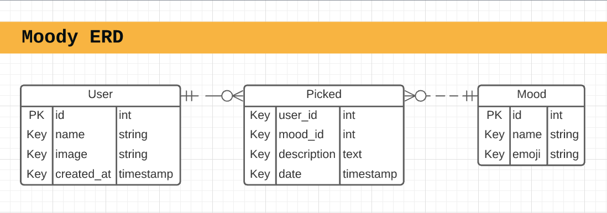
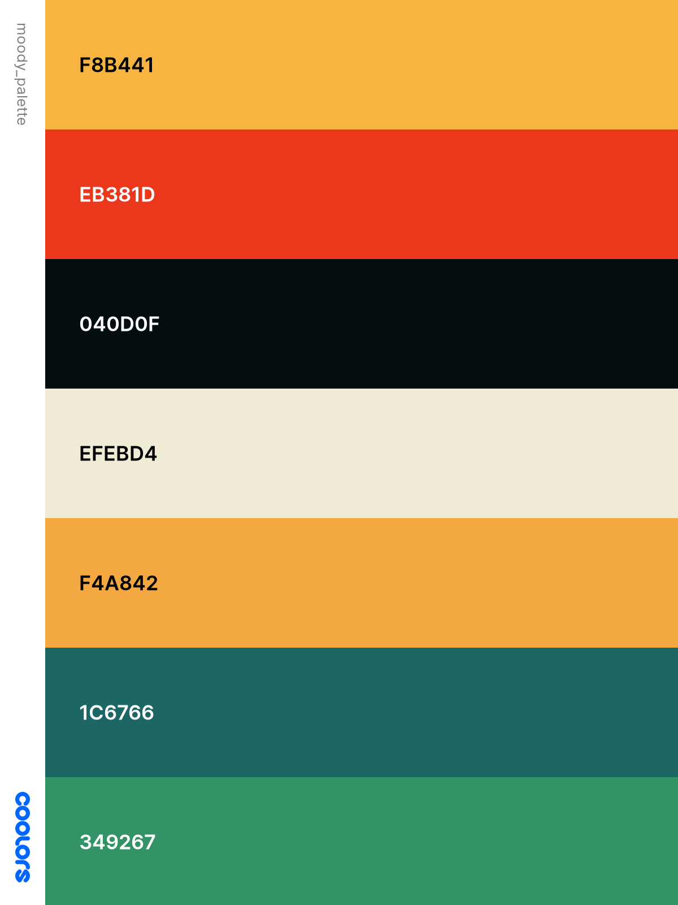

# MOODY

Open source mood tracker

## FEATURES

- track mood once per day
  - add short description
- history heatmap view
  - week, month, year, lifetime

## TECHSTACK

- firebase
- vuejs

## TODO

- [x] Create ERD
- [x] Create Vue App
- [x] Create Firebase Project
  - [x] Add rules
- [x] Add auth (Signin via Google so far)
- [ ] Add [VueFire](https://github.com/vuejs/vuefire/tree/master/packages/vuexfire)
- [ ] Create wireframes
  - [ ] Signin screen
  - [ ] Moodpicker screen
  - [ ] Overview screen
- [ ] Logo

## TABLES

[ERD Lucidchart](https://app.lucidchart.com/invitations/accept/ea5ea308-100d-422d-904e-8341194502ce)

### User

- id
- name
- image
- created_at

### Mood

- id
- name
- emoji

### Picked

- user_id
- mood_id
- description
- timestamp

###

## MISC

### color palette

- `#F8B441`
- `#EB381D`
- `#040D0F`
- `#EFEBD4`
- `#F4A842`
- `#1C6766`
- `#349267`
